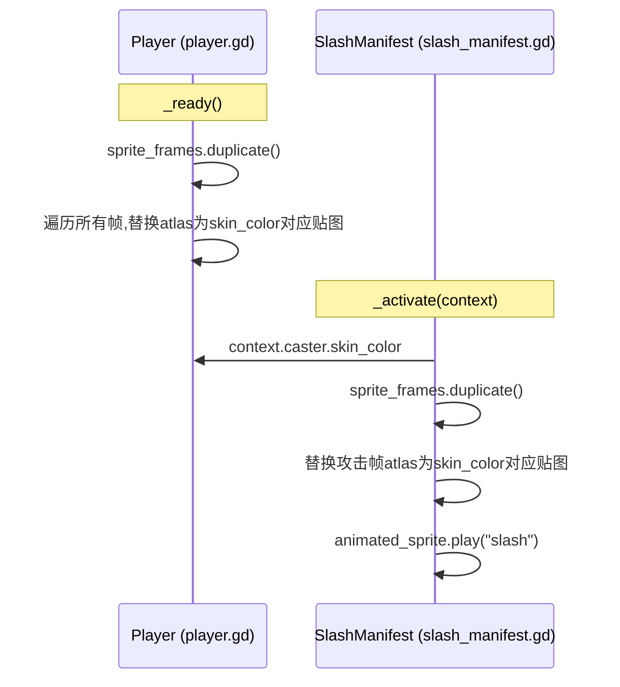

## 用户需求

为 PlayScene 中的4个 Player 实例分配不同颜色的外观（Blue/Red/Yellow/Purple/Black），动画结构完全相同，只是贴图颜色不同。

## 产品概述

4个 Player 共享同一个 Player.tscn 实例，当前全部使用蓝色 Warrior 贴图。需要通过 Inspector 属性为每个实例指定皮肤颜色，运行时自动加载对应颜色目录的贴图。攻击动画（SlashManifest）也需要同步换色，否则攻击时颜色会跳回蓝色。

## 核心功能

- Player 新增 `skin_color` 导出属性，在编辑器 Inspector 中可选 Blue/Red/Yellow/Purple/Black
- 运行时自动替换 Player 本体 AnimatedSprite2D 的 SpriteFrames 中所有 AtlasTexture 的 atlas 贴图
- 攻击时 SlashManifest 的 AnimatedSprite2D 也同步使用对应颜色的攻击贴图
- 不同 Player 实例之间互不影响

## Tech Stack

- Godot 4.x GDScript（沿用现有项目技术栈）

## Implementation Approach

**核心思路**：利用素材包自带5种颜色 Warrior 贴图，运行时动态替换 SpriteFrames 中的 AtlasTexture 的 atlas 引用。

**贴图路径映射**：将原始贴图路径中的 `Blue Units` 替换为 `{skin_color} Units`，用 `load()` 加载新贴图。例如：

- `res://assets/Tiny Swords (Free Pack)/Units/Blue Units/Warrior/Warrior_Idle.png` → `Red Units` → `res://assets/Tiny Swords (Free Pack)/Units/Red Units/Warrior/Warrior_Idle.png`

**两处换肤**：

1. **Player 本体**（player.gd）：

- `_ready()` 中，先 `sprite_frames.duplicate()` 使每个实例拥有独立的帧数据
- 遍历所有动画的所有帧，将 AtlasTexture 的 atlas 替换为对应颜色贴图

2. **SlashManifest 攻击动画**（slash_manifest.gd）：

- `_activate()` 中通过 `context.caster` 获取 Player 的 `skin_color`
- 替换攻击动画的 AtlasTexture 的 atlas 为对应颜色的 `Warrior_Attack1.png`
- 同样需要先 `sprite_frames.duplicate()` 确保不污染原始资源

**关键设计决策**：

- `skin_color` 放在 Player 而非 Entity，因为换肤是玩家概念，敌人（如 enemy.tscn）有独立的贴图体系
- 不修改 Player.tscn 或 slash_skill_manifest.tscn 场景文件，纯运行时替换，保持场景文件简洁
- 使用 `load()` 而非 `preload`，因为颜色由运行时变量决定
- 每次实例化 SlashManifest 都会重新加载贴图，但攻击频率低、贴图小，性能可忽略

**性能**：`load()` 在 _ready/activate 时各执行一次，3-4张贴图加载开销可忽略不计。

## Architecture Design



## Directory Structure

```
scripts/entity/
└── player.gd                # [MODIFY] 新增 skin_color 导出属性和 _apply_skin_color() 换肤方法

scripts/skills/manifest/
└── slash_manifest.gd        # [MODIFY] _activate() 中从 caster 获取 skin_color 并替换攻击贴图
```