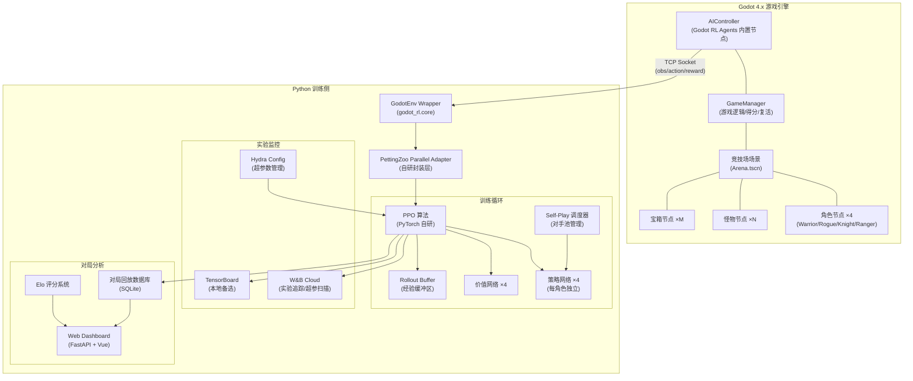
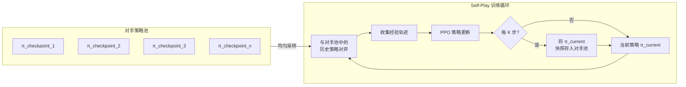
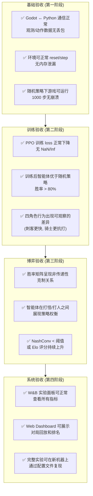

# Tiny Swords 系统设计说明


## 游戏策划案

### 概述

Tiny Swords 是一款基于 Godot 引擎的 2D 俯视角四人混战竞技场游戏，旨在作为多智能体强化学习的博弈环境。四名角色（Agent）在一个封闭的竞技场中进行自由对抗，通过移动与近战攻击争夺分数。游戏在核心对抗之上叠加了少量环境交互元素（野生怪物、分数球），以丰富策略空间并产生更具层次的博弈行为。

在goodt游戏代码中，野生野怪指敌人Enemy。

### 竞技场与比赛规则

#### 竞技场

竞技场为一个固定大小的矩形封闭地图，四周由不可通行的墙壁围成。四名角色分别在地图的四个角落出生。竞技场内有不可通行的障碍物，增加对抗复杂性。

#### 比赛流程

每局比赛持续固定时间步。比赛结束时，按累计得分排名。角色被击杀后在随机位置复活

####  胜负与得分

得分来源包括三个渠道：攻击其他玩家、击杀野生怪物、拾取奖励球。被攻击会扣分，随时间进行每秒加分或减分。最终排名即为该局的博弈结果，用于计算强化学习的奖励信号。

#### 额外效果设计

##### 野生怪物（敌人）

竞技场中随机刷新少量野生怪物。怪物行为：在小范围内随机游走，附近出现智能体在一定范围内追杀智能体，被击杀后掉落分数并在一段时间后重新刷新。

##### 奖励球

地图上随机位置刷新分数球，角色走到奖励球位置即自动拾取获得分数。

### 角色与能力差异化设计（暂不考虑）

为了在博弈中产生**非对称均衡**，四名角色拥有不同的属性侧重。这种差异化是体现清晰博弈的关键——如果四个角色完全相同，策略空间会退化为对称博弈，行为趋同。通过差异化，智能体需要学习"扬长避短"以及"针对性对抗"，从而涌现出更丰富的策略组合。

四个角色的属性分配如下表所示：

| 角色 | 生命值 | 移动速度 | 攻击力 | 攻击范围 | 攻击冷却 | 设计意图 |
|------|--------|----------|--------|----------|----------|----------|
| **战士 (Warrior)** | 5 | 1.0 | 2 | 1.0 格 | 3 s | 均衡型，无明显短板，适合正面交战 |
| **刺客 (Rogue)** | 3 | 1.5 | 3 | 0.8 格 | 4 s | 高速高攻但脆皮，擅长hit-and-run |
| **骑士 (Knight)** | 7 | 0.7 | 1 | 1.2 格 | 2 s | 高坦度长臂，适合阵地战与消耗 |
| **游侠 (Ranger)** | 4 | 1.2 | 2 | 1.5 格 | 5 s | 最远攻击距离，适合风筝与牵制 |

属性设计遵循**零和约束**：每个角色的综合能力总量大致相当（通过加权求和校验），确保没有角色在数值上碾压其他角色。博弈的不对称性来自属性的**分布差异**而非**总量差异**。

这种设计会自然产生如下博弈关系：刺客克制游侠（高速接近后秒杀脆皮），游侠克制骑士（远距离风筝慢速目标），骑士克制刺客（高血量扛住爆发后反杀），战士作为均衡者在各对局中不占优也不吃亏。这形成了一个类似"石头剪刀布"的非传递性博弈结构，有利于训练出多样化的策略。

### 动作空间

每个智能体在每个时间步选择以下 6 个离散动作之一：

| 动作编号 | 动作名称 | 描述 |
|:--------:|----------|------|
| 0 | 上移 (Move Up) | 向上移动一个单位距离（按角色速度缩放） |
| 1 | 下移 (Move Down) | 向下移动一个单位距离 |
| 2 | 左移 (Move Left) | 向左移动一个单位距离 |
| 3 | 右移 (Move Right) | 向右移动一个单位距离 |
| 4 | 无操作 (Idle) | 原地不动，不执行任何动作               |
| 5 | 攻击 (Attack) | 向前方攻击 |

关于动作设计的说明：朝向由最近一次移动方向决定，攻击沿当前朝向的扇形区域判定。加入"无操作"动作是因为在某些博弈态势下（如等待攻击冷却、观望局势），"不动"本身就是一种有意义的策略选择，能让智能体学到"等待"和"时机把握"的概念。攻击处于冷却中时选择攻击动作等效于无操作，但智能体需要自行学习这一点。

### 观测空间

每个智能体的观测向量包含以下信息（全部归一化到 [0, 1] 或 [-1, 1]）：

**自身状态**：自身 x 坐标、y 坐标、当前血量、最大血量，攻击力，攻击冷却剩余比例、朝向、挨饿时间（告知，否则智能体不知道为什么奖励少了，挨饿时间可以设定一个最大值，利用这个最大值进行归一化）。

**地图数据**：自身与边界的距离，自身相对于地图中碰撞物的坐标。

**视野侦测数据**：视野范围内所有的奖励球，野怪，其他玩家的信息，具体来说：

1. 奖励球：x坐标，y坐标
2. 野怪：x坐标，y坐标，当前血量，最大血量，攻击力，当前的状态（状态机获取，如果可以我希望智能体能够学到骗攻击，走位扭开别人攻击再趁别人技能正在冷却攻击）
3. 其余玩家：x坐标，y坐标，当前血量，最大血量，攻击力，当前的状态


### 奖励函数设计

设计理念：

1. 时间，或者说“机体能量”是**极其**宝贵的，以避免多余的动作，走路和攻击会减少奖励，但又不能不动摆烂，因此如果长时间没有奖励增加，将会开始持续减少奖励的“挨饿机制”，且减少速率逐渐加快
2. 存活占有一定权重，如果死亡后回到重生点，那么走到中央资源富集区也浪费时间，因此死亡会扣分，攻击导致其他智能体死亡会加分
3. 造成伤害加分，稀疏对抗奖励
4. 受击减分，稀疏存活奖励
5. 塑形奖励：朝奖励球有实际移动时加奖励，（根据情况考虑远离时是否减奖励）加快吃球的训练速度，离竞技场中央越近，每秒自动获得奖励越多，鼓励发生冲突。

设计如下：

| 事件 | 奖励值 |
|------|--------|
| 攻击其他玩家 | 待定 |
| 攻击野生怪物（敌人） | 待定 |
| 拾取奖励球 | 待定 |
| 被攻击 | 待定 |
| 造成攻击 | 待定 |
| 击杀野怪 | 待定 |
| 击杀玩家 | 待定 |
| 挨饿机制 | 触发计时时长，<br />基础减少数值，<br />减少率增加函数均待定 |


## 系统设计

### 一、技术选型总览

| 层级 | 技术选型 | 版本要求 | 选型理由 |
|------|----------|----------|----------|
| 游戏引擎 | Godot Engine | 4.x | 开源免费、GDScript 开发效率高、2D 性能优异、社区活跃 |
| 引擎-Python 桥接 | Godot RL Agents | ≥ 0.4 | 官方推荐的 Godot RL 桥接库，内置 TCP Socket 通信、Gym 标准接口封装 |
| 多智能体环境接口 | PettingZoo (Parallel API) | ≥ 1.24 | 多智能体 RL 的事实标准接口，支持并行步进模式，四智能体同时决策 |
| 训练框架 | 自研 PPO + PyTorch | PyTorch ≥ 2.0 | 多智能体竞争场景需要细粒度控制（独立策略网络、Self-Play 调度），现成框架封装过深不便定制 |
| 备选训练框架 | CleanRL / RLlib | — | CleanRL 单文件实现便于理解和魔改；RLlib 适合后期需要分布式扩展时切换 |
| 实验追踪 | Weights & Biases (W&B) | ≥ 0.16 | 云端多实验对比、超参数扫描 (Sweep)、团队协作、自动记录系统指标 |
| 本地可视化备选 | TensorBoard | ≥ 2.14 | 零依赖本地可视化，适合离线调试和无网络环境 |
| 配置管理 | Hydra + OmegaConf | ≥ 1.3 | YAML 配置文件管理超参数，支持命令行覆盖和多组实验配置组合 |
| 对局回放与分析 | 自研 Web Dashboard (FastAPI + Vue) | — | 轻量 Web 后端展示对局回放、Elo 排名、策略热力图等博弈分析结果 |

### 二、技术选型论证

#### 2.1 为什么选 Godot 而非 Unity / 纯 Python 环境

Unity ML-Agents 虽然成熟度更高，但 Unity 是商业引擎，且 C# 开发门槛较高。纯 Python 环境（如直接用 Pygame 或 NumPy 模拟）虽然通信零延迟，但缺乏游戏引擎的碰撞检测、动画系统和可视化能力，后期展示效果差。Godot 4.x 在三者之间取得了最佳平衡：完全开源（MIT 协议）、GDScript 语法接近 Python 学习成本低、2D 物理和渲染性能足够、且 Godot RL Agents 库提供了开箱即用的 RL 桥接方案。

#### 2.2 为什么用 PettingZoo 而非 Godot RL Agents 原生多智能体

Godot RL Agents 原生支持的是"多个相同智能体共享同一策略"的模式，适合群体行为学习。但本项目的四个角色属性不同、策略应独立，属于**异构竞争性多智能体**场景。PettingZoo 的 Parallel API 天然支持这种模式：每个智能体有独立的观测空间、动作空间和奖励，且所有智能体在同一时间步并行决策。因此，在 Godot RL Agents 的 TCP 通信层之上，再封装一层 PettingZoo Parallel API 是最合理的架构。

#### 2.3 为什么自研 PPO 而非直接用 SB3 / RLlib

Stable Baselines3 (SB3) 是优秀的单智能体 RL 库，但对多智能体竞争博弈的支持有限——它没有内置 Self-Play 机制，也不方便为不同智能体配置不同的网络结构。RLlib 功能强大但过于重量级，配置复杂，调试困难，对于课题项目来说学习成本过高。自研 PPO 基于 PyTorch 实现，代码量约 300-500 行（参考 CleanRL 的单文件 PPO 实现），完全可控，便于实现以下定制需求：为四个角色维护独立的策略网络和价值网络、实现 Self-Play 对手池调度、灵活调整奖励塑形逻辑。

#### 2.4 为什么用 W&B 而非纯 TensorBoard

TensorBoard 是免费的本地工具，适合快速查看单次训练的 loss 曲线。但在多智能体博弈实验中，需要同时对比大量实验（不同超参数、不同对手组合、不同奖励函数），TensorBoard 在多实验对比和超参数扫描方面能力不足。W&B 提供云端 Dashboard，支持 Sweep（自动超参数搜索）、分组对比、自定义图表，且对学术用户免费。实际使用中，训练脚本同时向 W&B 和本地 TensorBoard 写入日志，两者互为备份。

### 三、整体架构图



### 四、分层架构说明

整个系统分为三层。**环境层**（Godot Engine）负责游戏逻辑的执行、物理碰撞检测、视觉渲染和状态序列化。**训练层**（Python）负责从环境接收观测、通过策略网络推理动作、收集经验轨迹并更新网络参数。**监控与分析层**负责实验追踪、超参数管理和博弈结果的可视化分析。

三层之间的通信边界清晰：环境层与训练层之间通过 Godot RL Agents 内置的 TCP Socket 通信，数据格式为序列化的 NumPy 数组；训练层与监控层之间通过 W&B SDK 和 TensorBoard SummaryWriter 写入日志；分析层通过读取 SQLite 数据库中的对局记录生成可视化报告。

### 五、目录结构

```
multi-agent-gameplay/
├── godot_project/                  # Godot 4.x 工程目录
│
├── python/                         # Python 训练侧
├── requirements.txt                # Python 依赖
└── readme.md                       # 本文件
```


## 马尔可夫决策过程 (MDP) 形式化定义

本项目的多智能体博弈环境可形式化为一个**马尔可夫博弈 (Markov Game)**，也称随机博弈 (Stochastic Game)，它是单智能体 MDP 在多智能体场景下的自然推广。

### 一、形式化定义

一个四人马尔可夫博弈定义为元组 $\langle \mathcal{N}, \mathcal{S}, \{\mathcal{A}_i\}_{i \in \mathcal{N}}, \mathcal{T}, \{R_i\}_{i \in \mathcal{N}}, \gamma \rangle$，各元素含义如下：

**智能体集合** $\mathcal{N} = \{1, 2, 3, 4\}$，分别对应战士、刺客、骑士、游侠四个角色。

**状态空间** $\mathcal{S}$：全局游戏状态，包含所有角色的位置 $(x_i, y_i)$、生命值 $hp_i$、攻击冷却计时器 $cd_i$、朝向 $dir_i$、存活状态 $alive_i$、无敌状态 $invuln_i$，以及所有怪物和宝箱的位置与状态，还有每对 (attacker, victim) 的击杀衰减计数器。全局状态是完全可观测的（对环境而言），但每个智能体只能获取以自身为中心的**局部观测** $o_i = O_i(s)$。

**动作空间** $\mathcal{A}_i = \{0, 1, 2, 3, 4, 5\}$：对所有智能体相同，分别对应上移、下移、左移、右移、攻击、无操作。虽然动作空间相同，但由于角色属性不同（速度、攻击力、攻击范围、冷却时间），相同动作在不同角色上产生不同效果。

**状态转移函数** $\mathcal{T}: \mathcal{S} \times \mathcal{A}_1 \times \mathcal{A}_2 \times \mathcal{A}_3 \times \mathcal{A}_4 \rightarrow \Delta(\mathcal{S})$：给定当前状态和所有智能体的联合动作，输出下一状态的概率分布。转移函数的随机性来源于怪物的随机游走和宝箱的随机刷新位置。

**奖励函数** $R_i: \mathcal{S} \times \mathcal{A}_1 \times ... \times \mathcal{A}_4 \times \mathcal{S} \rightarrow \mathbb{R}$：每个智能体有独立的奖励函数，具体数值见策划案第八节的奖励函数设计表。

**折扣因子** $\gamma \in [0, 1)$：设为 0.99，表示智能体对未来奖励的重视程度。由于每局有固定时间步上限，折扣因子主要影响智能体对短期收益与长期生存的权衡。

### 二、观测函数

每个智能体 $i$ 在时间步 $t$ 获取的观测 $o_i^t = O_i(s^t)$ 是全局状态的一个投影，以自身为中心进行坐标变换。观测函数的设计确保了**部分可观测性**——智能体无法直接获知其他智能体的攻击冷却状态和击杀衰减计数器，需要通过学习来推断对手的行为模式。

### 三、策略与优化目标

每个智能体 $i$ 的策略 $\pi_i: \mathcal{O}_i \rightarrow \Delta(\mathcal{A}_i)$ 是从观测到动作概率分布的映射，由参数为 $\theta_i$ 的神经网络表示。优化目标是最大化每个智能体的期望累计折扣奖励：

$$J(\theta_i) = \mathbb{E}_{\pi_1, ..., \pi_4} \left[ \sum_{t=0}^{T} \gamma^t R_i(s^t, a_1^t, ..., a_4^t, s^{t+1}) \right]$$

由于每个智能体的奖励不仅取决于自身策略，还取决于其他三个智能体的策略，这构成了一个**非合作博弈**问题。训练的目标是找到一个近似的**纳什均衡**，即没有任何单个智能体能通过单方面改变策略来提高自身收益。

### 四、Self-Play 训练机制

为了在训练中逼近纳什均衡，采用 **Self-Play** 机制：每个智能体的对手从历史策略池中采样。具体而言，维护一个策略检查点池，每隔固定训练步数将当前策略存入池中。训练时，当前智能体与从池中均匀采样的历史策略进行对弈。这种机制防止策略过拟合到特定对手，促进策略的鲁棒性和多样性。




## 接口与通信协议


### 数据格式规范

#### 观测数据 (Godot → Python)


#### 动作数据 (Python → Godot)


#### 环境控制信号

除了常规的 obs/action 交换，还需要以下控制信号：`reset`（重置环境开始新一局）、`close`（关闭环境释放资源）、`seed`（设置随机种子以确保可复现性）。这些信号通过 Godot RL Agents 的标准接口传递。

### 三、PettingZoo Adapter 接口定义


### 四、Godot 侧 AIController 接口

在 Godot 侧，每个角色节点挂载一个 AIController 子节点（继承自 Godot RL Agents 提供的基类）。需要实现以下三个核心回调方法：

```gdscript
# ai_controller.gd
extends AIController3D  # Godot RL Agents 提供的基类

func get_obs() -> Dictionary:
    # 收集当前智能体的观测向量, 返回 {"obs": PackedFloat32Array}
    ...

func get_reward() -> float:
    # 计算当前时间步的即时奖励
    ...

func set_action(action: int) -> void:
...
```


## 实验管理与超参数配置方案

### 一、超参数配置体系

使用 Hydra + OmegaConf 管理所有超参数，配置文件采用 YAML 格式，支持层级覆盖和命令行动态修改。

#### 默认配置文件 (`configs/reward.yaml`)

```yaml

```


### 二、W&B 实验追踪方案

#### 2.1 记录指标

训练过程中向 W&B 记录以下指标：

**训练指标**：每个智能体的 policy loss、value loss、entropy、clip fraction、explained variance、学习率。

**博弈指标**：每个角色的平均得分、击杀数、死亡数、K/D 比率、宝箱拾取数、怪物击杀数；四角色之间的胜率矩阵（6 对对局的胜率）；策略熵（衡量策略的探索程度）。

**系统指标**（W&B 自动采集）：GPU 利用率、内存占用、训练速度（steps/sec）。

#### 2.2 W&B Sweep 超参数搜索

```yaml
# configs/sweep.yaml
method: bayes              # 贝叶斯优化
metric:
  name: eval/mean_score
  goal: maximize
parameters:
  ppo.learning_rate:
    distribution: log_uniform_values
    min: 1.0e-5
    max: 1.0e-3
  ppo.entropy_coef:
    values: [0.001, 0.005, 0.01, 0.02]
  ppo.clip_epsilon:
    values: [0.1, 0.2, 0.3]
  network.hidden_sizes:
    values: [[64, 64], [128, 128], [256, 256]]
```

### 三、TensorBoard 本地日志

作为 W&B 的本地备选，训练脚本同时通过 `torch.utils.tensorboard.SummaryWriter` 写入本地日志。日志存储在 `runs/` 目录下，按实验名和时间戳组织。在无网络环境下，可通过 `tensorboard --logdir runs/` 启动本地可视化。

### 四、实验记录与可复现性

每次实验启动时，系统自动记录以下信息以确保可复现性：完整的 Hydra 配置快照（含所有命令行覆盖）、Git commit hash、Python 环境依赖版本（`pip freeze`）、随机种子。所有信息同步上传至 W&B 的 Artifacts 中，任何历史实验均可精确复现。


## 评估基准与验收标准

### 一、评估指标体系

#### 1.1 训练收敛性指标

**平均回合奖励 (Mean Episode Reward)**：每个角色在评估对局中的平均累计奖励，应随训练推进呈上升趋势并最终收敛。收敛判定标准为连续 10 次评估（每次 20 局）的平均奖励波动不超过 5%。

**策略熵 (Policy Entropy)**：衡量策略的随机性。训练初期应较高（充分探索），后期应逐渐降低但不坍缩至零（保持一定的策略多样性）。若熵过早降至接近零，说明策略过早收敛到确定性行为，需要增大 `entropy_coef`。

#### 1.2 博弈质量指标

**胜率矩阵 (Win Rate Matrix)**：四个角色两两对战的胜率统计（共 6 对）。理想情况下应呈现非传递性克制关系（刺客 > 游侠 > 骑士 > 刺客），且战士与其他三者的胜率接近 50%。

**纳什均衡偏离度 (NashConv)**：衡量当前策略组合距离纳什均衡的距离。计算方法为每个智能体在固定其他智能体策略时，通过最佳响应能获得的额外收益之和。NashConv 越接近零，说明策略组合越接近均衡。

**Elo 评分**：为每个训练检查点计算 Elo 评分，通过循环赛（Round-Robin）方式让不同训练阶段的策略相互对弈。Elo 评分的上升趋势反映了策略的持续进步。

#### 1.3 行为多样性指标

**动作分布均匀度**：统计每个角色在评估对局中各动作的选择频率。若某个动作的频率低于 2%，说明智能体可能没有学会利用该动作。

**空间覆盖率**：将地图划分为网格，统计角色在一局中访问过的网格比例。覆盖率过低说明智能体倾向于扎堆在某个区域。

**策略差异度**：计算不同角色策略网络在相同观测下输出的动作分布的 KL 散度。差异度越高，说明角色之间的行为差异化越明显。

### 二、验收标准



### 三、基线对比方案

为了验证训练出的智能体确实学到了有意义的策略，设置以下基线进行对比：

**随机策略基线 (Random)**：每步均匀随机选择动作。训练后的智能体应以 80% 以上胜率击败随机策略。

**规则策略基线 (Rule-based)**：手写简单规则——追击最近的敌人，血量低时逃跑，路过宝箱时拾取。训练后的智能体应以 60% 以上胜率击败规则策略。

**自身历史策略 (Self-Play History)**：与训练过程中早期的策略检查点对弈。Elo 评分应持续上升，表明策略在不断进步。
